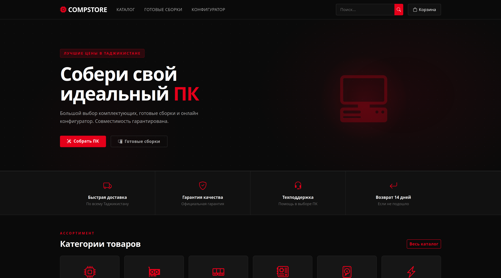
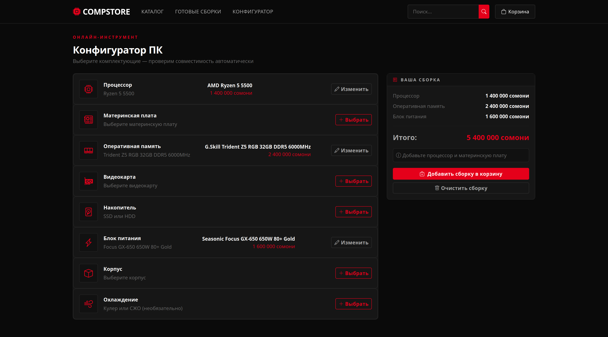
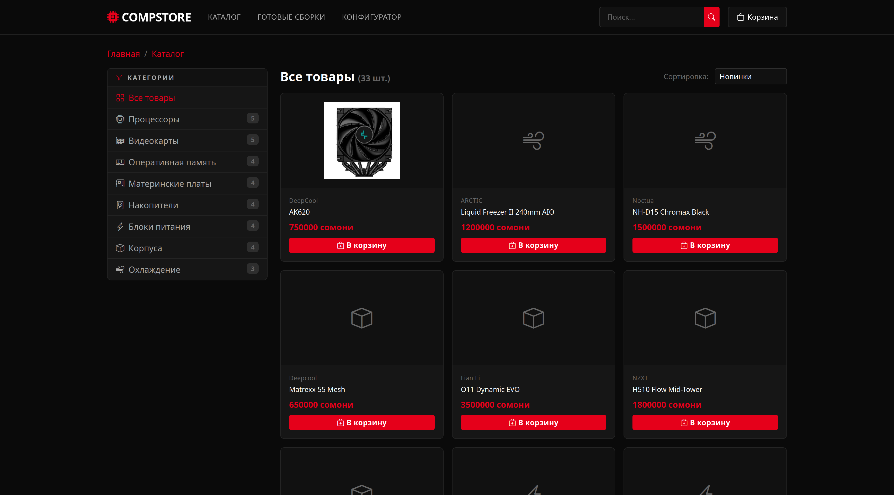

# CompStore — Магазин компьютерных комплектующих

> Полнофункциональный интернет-магазин компьютерных комплектующих с онлайн-конфигуратором ПК, готовыми сборками и корзиной покупок. Разработан на Django 6, развёртывается через Docker Compose.

---

## Возможности

- **Каталог** — товары по категориям (CPU, GPU, RAM, Motherboard, Storage, PSU, Case, Cooling) с сортировкой, фильтрацией и поиском
- **Конфигуратор ПК** — интерактивная онлайн-сборка с проверкой совместимости сокетов CPU/Motherboard в реальном времени
- **Готовые сборки** — преднастроенные конфигурации уровней Старт / Мидл / Про с полным списком комплектующих
- **Корзина** — сессионная корзина без регистрации (изменение количества, удаление)
- **Оформление заказа** — форма с контактными данными, городом, адресом и выбором способа оплаты
- **Админ-панель** — кастомизированный Django Admin для управления товарами, категориями, сборками и заказами

---

## Стек

| Слой | Технология |
|------|-----------|
| Backend | Python 3.12, Django 6.0.3 |
| Frontend | Bootstrap 5.3, Bootstrap Icons |
| База данных | SQLite (dev) |
| Web-сервер | Gunicorn + Nginx |
| Деплой | Docker, Docker Compose |

---

## Быстрый старт (Docker)

```bash
# 1. Клонировать репозиторий
git clone https://github.com/your-username/compstore.git
cd compstore

# 2. Создать файл окружения
cp .env.example .env
# Отредактировать .env при необходимости

# 3. Запустить
docker compose up -d --build

# 4. Создать суперпользователя
docker compose exec web python manage.py createsuperuser

# 5. Загрузить тестовые данные
docker compose exec web python manage.py seed_data
```

Сайт откроется на `http://localhost`, админ-панель — `http://localhost/admin`

---

## Быстрый старт (локально)

```bash
cd CompStore

python -m venv venv
source venv/bin/activate        # Windows: venv\Scripts\activate

pip install -r requirements.txt

python manage.py migrate
python manage.py seed_data      # загрузить тестовые данные
python manage.py createsuperuser

python manage.py runserver
```

---

## Переменные окружения

Скопируй `.env.example` в `.env` и заполни:

| Переменная | По умолчанию | Описание |
|-----------|-------------|---------|
| `SECRET_KEY` | insecure-key | Django secret key (обязательно сменить) |
| `DEBUG` | `False` | Режим отладки |
| `ALLOWED_HOSTS` | `localhost,127.0.0.1` | Разрешённые хосты через запятую |
| `CSRF_TRUSTED_ORIGINS` | — | Доверенные origin для CSRF (напр. `https://example.com`) |

Сгенерировать новый `SECRET_KEY`:
```bash
python -c "from django.core.management.utils import get_random_secret_key; print(get_random_secret_key())"
```

---

## Структура проекта

```
CompStore/
├── CompStore/           # Конфиг Django (settings, urls, wsgi)
├── store/               # Основное приложение
│   ├── models.py        # Category, Product, PrebuiltPC, Cart, Order
│   ├── views.py         # Все представления
│   ├── urls.py          # URL-маршруты
│   ├── admin.py         # Кастомный Django Admin
│   └── management/
│       └── commands/
│           └── seed_data.py  # Команда для заполнения тестовыми данными
├── templates/           # HTML-шаблоны (base + store)
├── static/              # CSS, JS
├── media/               # Загружаемые изображения товаров
├── nginx/
│   └── nginx.conf       # Конфиг Nginx
├── Dockerfile
├── docker-compose.yml
├── entrypoint.sh
└── .env.example
```

---

## Команды Django

```bash
# Применить миграции
python manage.py migrate

# Загрузить тестовые данные (8 категорий, 33 товара, 3 готовые сборки)
python manage.py seed_data

# Собрать статику (для продакшена)
python manage.py collectstatic --noinput
```

---

## Скриншоты

| Главная | Конфигуратор | Каталог |
|---------|-------------|---------|
|  |  |  |

---

## Лицензия

MIT License — используй, модифицируй, распространяй свободно.
